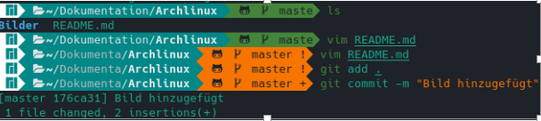

# Archlinux Installation (VirtualBox)

### Tastaturlayout ändern
	loadkey de-latin1
### erstes Bild
 
### Überprüfen wie die Festplatte heißt
	lsblk
### Datenbank refresh
	pacman -Syy
### Mirrors aktualisieren (reflector)
	reflector -c Germany -a 6 --sort rate --save /etc/pacman.d/mirrorlist
### Datenbank refresh
	pacman -Syy
### Partitionierungstools starten
	cfdisk /dev/sda # /dev/sda ja nach HDD-Typ unterschiedlich
gpt Partitionstabelle erstellen
1. 300MB >> EFI >> EFI System
2. 4GB >> SWAP >> Linux Swap
3. 30GB >> / >> LinuxFileSystem
4. Rest >> /home >> LinuxFileSystem
5. Write >> Quit

	lsblk
### Partitionsformat
#### EFI Format FAT 32
	mkfs.fat -F32 /dev/sda1  # /dev/sda* ja nach HDD-Typ unterschiedlich
#### SWAP Format
	mkswap /dev/sda2
#### SWAP aktivieren
	swapon /dev/sda2
#### Root Format ext4
	mkfs.ext4 /dev/sda3
#### Home Format ext4
	mkfs.ext4 /dev/sda4
