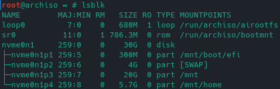

# Archlinux Installation (VirtualBox)

## auf Arch-Linux-Host ausführen
### Tastaturlayout ändern
	loadkey de-latin1
	systemctl status sshd
	passwd		#Passwort für Root ändern für ssh zugriff nötig
	ip addr		#

## Zugriff über sshd vom Client aus
	sshd root@<IP-Adresse des Hosts>
### Überprüfen wie die Festplatte heißt
	lsblk
### Datenbank refresh
	pacman -Syy
### Mirrors aktualisieren (reflector)
	reflector -c Germany -a 6 --sort rate --save /etc/pacman.d/mirrorlist
### Datenbank refresh
	pacman -Syy
### Partitionierungstools starten
	cfdisk /dev/sda # /dev/sda ja nach HDD-Typ kann die Adresse unterschiedlich sein
			# sda 		- SATA
			# nvme0n1	- NVME

gpt Partitionstabelle erstellen
1. 300MB >> EFI >> EFI System
2. 4GB >> SWAP >> Linux Swap
3. 30GB >> / >> LinuxFileSystem
4. Rest >> /home >> LinuxFileSystem
5. Write >> Quit

	lsblk

### Formatieren der Partitionen 
Achtung:
/dev/sda* ja nach HDD-Typ unterschiedlich
/dev/nvme0n1p1 #bei NVME-SSD'S

	mkfs.fat -F32 /dev/sda1 # EFI Fromat Fat32
	mkswap /dev/sda2 	# Swap Format
	swapon /dev/sda2	# Swap aktivieren
	mkfs.ext4 /dev/sda3	# Root-Format ext4
	mkfs.ext4 /dev/sda4	# Home-Format ext4

	lsblk			# Partitionierung überprüfen

 

### Mountpunkte anlegen
	mount /dev/sda3 /mnt		# /dev/nvme0n1p3
	mount /dev/sda1 /mnt/boot/efi	# /dev/nvme0n1p1
	mkdir /mnt/home			# 
	mount /dev/sda4 /mnt/home	# /dev/nvme0n1p4

	lsbkl				# Überprüfung der Mountpunkte

 

### Base Pakete installieren
	pacstrap /mnt base base-devel linux linux-firmware git vim intel-ucode grub efibootmgr virtualbox-guest-utils lxde

### File-Systemtable generieren
	genfstab -U /mnt >> /mnt/etc/fstab
	cat /mnt/etc/fstab

### Root User in neuer Installation wechseln
	arch-chroot /mnt
### Zeitzone anpassen
	date
	ln -sf /usr/share/zoneinfo/Europe/Berlin /etc/localtime
	hwclock --systohc	# Zeit synchronisieren
	date
### Locales   
	echo 'de_DE.UTF-8 UTF-8' >> /etc/locale.gen
	echo 'en_US.UTF-8 UTF-8' >> /etc/locale.gen
	echo 'LANG=de_DE.UTF-8' >> /etc/locale.conf
	echo 'KEYMAP=de-latin1' >> /etc/vconsole.conf
	echo "archlinux" >> /etc/hostname
	echo "127.0.0.1 localhost" >> /etc/hosts
	echo "::1       localhost" >> /etc/hosts
### Root Password Aendern
	passwd
### Extra Pakete installieren - je nach Bedarf anpassen
	pacman -S sudo grub efibootmgr networkmanager network-manager-applet dialog wpa_supplicant mtools dosfstools base-devel linux-headers avahi xdg-user-dirs xdg-utils gvfs gvfs-smb nfs-utils inetutils dnsutils bluez bluez-utils cups hplip alsa-utils pipewire pipewire-alsa pipewire-pulse pipewire-jack bash-completion openssh rsync reflector acpi acpi_call tlp virt-manager qemu qemu-arch-extra edk2-ovmf bridge-utils dnsmasq vde2 openbsd-netcat iptables-nft ipset firewalld flatpak sof-firmware nss-mdns acpid os-prober ntfs-3g terminus-font

### Installation von alternativen Oberflächen

### Grub Installation
	grub-install --target=x86_64-efi --efi-directory=/boot/efi --bootloader-id=GRUB
	grub-mkconfig -o /boot/grub/grub.cfg

### Dienste Starten      
	systemctl enable NetworkManager
	systemctl enable bluetooth
	systemctl enable cups.service
	systemctl enable sshd
	systemctl enable avahi-daemon
	systemctl enable tlp
	systemctl enable reflector.timer
	systemctl enable fstrim.timer
	systemctl enable libvirtd
	systemctl enable firewalld
	systemctl enable acpid
	systemctl enable lxdm
	systemctl enable vboxservice

### Neuen User anlegen
	useradd -mG wheel <USER-Name> #Benutzernamen eingeben
	visudo

	passwd <USER-Name>

### Neustarten            
	exit
	umount -a
	reboot

ISO entfernen

# Archlinux via Shellskript installieren
Archlinux vom Installationsmedium starten
ssh Zugang einrichten

	scp install.sh root@<IP-Archlinux>:/root
	ssh root@<IP-Archlinux>
	chmod u+x install.sh
	ls -lah
	sh install.sh

# Repository hinzufügen und den Browser Brave installieren
	sudo pacma –S base-devel # wird für makepkg benötigt
	sudo vim /etc/sudoers #Zeile 85 Auskommentierung entfernen
	su christian
	cd /opt
	sudo git clone https://aur.archlinux.org/yay-git.git
	sudo chown –R christian:christian ./yay-git
	cd yay-git/
	makepkg -si
	yay –Ss brave
	yay –S brave-bin
	yay –S ulauncher

# alternativen Terminal installieren und konfigurieren
	Sudo pacman –S zsh
	chsh –s $(which zsh) 
	curl -L http://install.ohmyz.sh | sh
	git clone --depth=1 https://github.com/romkatv/powerlevel10k.git ~/powerlevel10k
	echo 'source ~/powerlevel10k/powerlevel10k.zsh-theme' >>~/.zshrc
	sudo pacman -S tldr
	vim .zshrc
	ZSH_THEME="powerlevel10k/powerlevel10k"
	zsh
	konfiguration von powerlevel10k starten und konfigurieren wie es euch am besten passt
	als folgende installiere ich Fonts aus tutorial: https://ostechnix.com/install-nerd-fonts-to-add-glyphs-in-your-code-on-linux/
	cd Downloads
	wget https://github.com/ryanoasis/nerd-fonts/releases/download/v2.1.0/Hermit.zip
	wenn packet wget nicht installiert ist dann, sudo pacman -S wget
	sudo pacman -S zip unzip
	unzip Hermit.zip
	mkdir ~/.local/share/fonts
	cp ~/Downloads/Hurmit*.otf ~/.local/share/fonts/
	yay -S nerd-fonts-hermit
	fc-cache -fv
	sudo fc-cache -fv
	mkdir Repository
	cd Repository

### ToDO:
	# eigentlich eure eigene Repository:
	git clone https://github.com/renatex/ArchLinux.git
	cd ArchLinux
	git checkout test
	cp kitty.conf ~/.config/kitty/
	kitty neu starten
	nach kitty neu start...
	p10k configure
	git clone https://github.com/zsh-users/zsh-autosuggestions.git $ZSH_CUSTOM/plugins/zsh-autosuggestions
	git clone https://github.com/zsh-users/zsh-syntax-highlighting.git $ZSH_CUSTOM/plugins/zsh-syntax-highlighting
	Now add those plugin in .zshrc file.
	vim .zshrc
	plugins = (git zsh-autosuggestions zsh-syntax-highlighting) # Zeile 80

